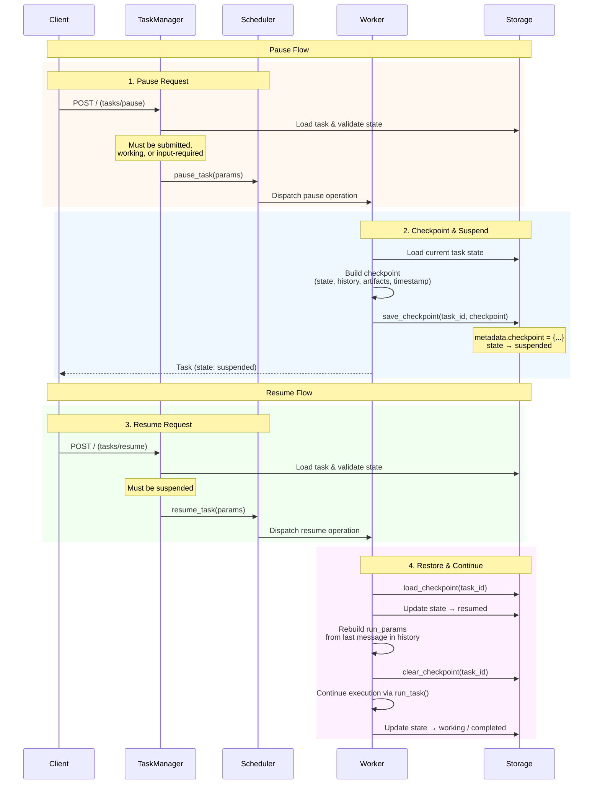
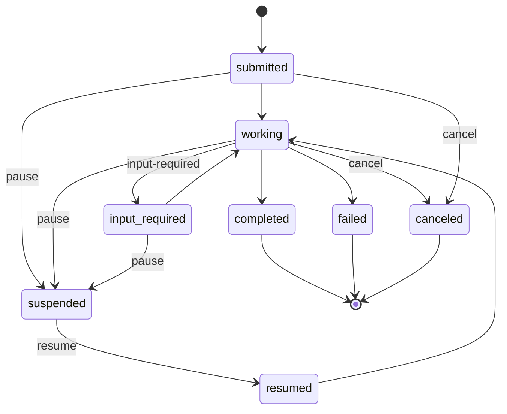

# Pause & Resume

Bindu supports pausing and resuming long-running tasks with automatic checkpoint persistence. This allows agents to gracefully suspend work, preserve execution state, and continue later without data loss.

**Pause/Resume is a Bindu extension** — it extends the A2A protocol with `tasks/pause` and `tasks/resume` JSON-RPC methods, `suspended`/`resumed` task states, and dedicated error codes.

## Architecture



## Task State Lifecycle



## JSON-RPC Methods

### `tasks/pause`

Pause a running task, saving its execution state as a checkpoint.

**Request:**
```json
{
  "jsonrpc": "2.0",
  "id": "req-123",
  "method": "tasks/pause",
  "params": {
    "task_id": "550e8400-e29b-41d4-a716-446655440000"
  }
}
```

**Success Response:**
```json
{
  "jsonrpc": "2.0",
  "id": "req-123",
  "result": {
    "id": "550e8400-e29b-41d4-a716-446655440000",
    "status": {
      "state": "suspended",
      "timestamp": "2026-02-17T06:00:00Z"
    },
    "metadata": {
      "checkpoint": {
        "paused_from_state": "working",
        "message_history": [...],
        "artifacts": [...],
        "paused_at": "2026-02-17T06:00:00Z"
      }
    }
  }
}
```

**Error Responses:**

| Code | Error | Condition |
|------|-------|-----------|
| `-32001` | `TaskNotFoundError` | Task ID does not exist |
| `-32040` | `TaskNotPausableError` | Task not in a pausable state |

### `tasks/resume`

Resume a suspended task, restoring execution from checkpoint.

**Request:**
```json
{
  "jsonrpc": "2.0",
  "id": "req-456",
  "method": "tasks/resume",
  "params": {
    "task_id": "550e8400-e29b-41d4-a716-446655440000"
  }
}
```

**Success Response:**
```json
{
  "jsonrpc": "2.0",
  "id": "req-456",
  "result": {
    "id": "550e8400-e29b-41d4-a716-446655440000",
    "status": {
      "state": "resumed",
      "timestamp": "2026-02-17T06:05:00Z"
    }
  }
}
```

**Error Responses:**

| Code | Error | Condition |
|------|-------|-----------|
| `-32001` | `TaskNotFoundError` | Task ID does not exist |
| `-32041` | `TaskNotResumableError` | Task not in `suspended` state |

## Pausable States

Only tasks in these states can be paused:

| State | Description |
|-------|-------------|
| `submitted` | Task accepted but not yet started |
| `working` | Task actively being processed |
| `input-required` | Task awaiting user input |

Tasks in terminal states (`completed`, `failed`, `canceled`, `rejected`) or already `suspended` cannot be paused.

## Checkpoint Data

When a task is paused, the worker builds a checkpoint and stores it in the task's `metadata.checkpoint` field:

```python
checkpoint = {
    "paused_from_state": "working",       # State before suspension
    "message_history": [...],             # Full message history at pause time
    "artifacts": [...],                   # Artifacts produced so far
    "paused_at": "2026-02-17T06:00:00Z", # ISO 8601 timestamp
}
```

The checkpoint is persisted via `Storage.save_checkpoint()` which writes to the task's JSONB `metadata` column — no schema migration required.

On resume, the worker:
1. Loads the checkpoint via `Storage.load_checkpoint()`
2. Transitions the task to `resumed` state
3. Rebuilds `run_params` from the last message in history
4. Clears the checkpoint via `Storage.clear_checkpoint()`
5. Calls `run_task()` to continue execution

## Configuration

Pause/resume is automatically enabled. The following settings control behavior:

```python
# bindu/settings.py - AgentSettings

# States that allow pausing
pausable_states: frozenset[str] = frozenset({"submitted", "working", "input-required"})

# Method handlers (auto-configured)
method_handlers = {
    "tasks/pause": "pause_task",
    "tasks/resume": "resume_task",
    # ... other handlers
}

# suspended is a non-terminal state (tasks can be resumed)
non_terminal_states: frozenset[str] = frozenset({..., "suspended"})
```

## Worker Implementation

### Base Worker

The `BaseWorker` class provides default `_handle_pause()` and `_handle_resume()` implementations that handle checkpoint persistence and task state transitions. Custom workers inherit this behavior automatically.

### Manifest Worker

`ManifestWorker` extends the base implementation with:

- **OpenTelemetry tracing**: Span events for pause/resume state changes
- **Lifecycle notifications**: Push notifications via `_notify_lifecycle()`
- **Retry logic**: `@retry_worker_operation(max_attempts=2)` decorator for resilience

## Storage Methods

Three convenience methods are available on the `Storage` base class:

| Method | Description |
|--------|-------------|
| `save_checkpoint(task_id, checkpoint)` | Persist checkpoint to `metadata.checkpoint`, set state to `suspended` |
| `load_checkpoint(task_id)` | Read `metadata.checkpoint`, returns `None` if absent |
| `clear_checkpoint(task_id)` | Set `metadata.checkpoint` to `None` after successful resume |

These work with both `InMemoryStorage` and `PostgresStorage` — the checkpoint data is stored in the JSONB `metadata` column.

## Error Codes

| Code | Type | Description |
|------|------|-------------|
| `-32040` | `TaskNotPausableError` | Task cannot be paused in its current state |
| `-32041` | `TaskNotResumableError` | Task cannot be resumed (not in `suspended` state) |

These follow the A2A error code convention (server errors in the -32000 to -32099 range).

## Example Usage

### Pause a running task

```bash
curl -X POST http://localhost:8000/ \
  -H "Content-Type: application/json" \
  -d '{
    "jsonrpc": "2.0",
    "id": "pause-1",
    "method": "tasks/pause",
    "params": {"task_id": "550e8400-e29b-41d4-a716-446655440000"}
  }'
```

### Resume a suspended task

```bash
curl -X POST http://localhost:8000/ \
  -H "Content-Type: application/json" \
  -d '{
    "jsonrpc": "2.0",
    "id": "resume-1",
    "method": "tasks/resume",
    "params": {"task_id": "550e8400-e29b-41d4-a716-446655440000"}
  }'
```

### Check checkpoint data

```bash
curl -X POST http://localhost:8000/ \
  -H "Content-Type: application/json" \
  -d '{
    "jsonrpc": "2.0",
    "id": "get-1",
    "method": "tasks/get",
    "params": {"task_id": "550e8400-e29b-41d4-a716-446655440000"}
  }'
# Response includes metadata.checkpoint when task is suspended
```

## Testing

40 unit tests cover the pause/resume feature:

```bash
pytest tests/unit/test_pause_resume.py -v
```

Test categories:
- **TestPauseTask** (8 tests): Validation of pausable/non-pausable states
- **TestResumeTask** (5 tests): Validation of resumable/non-resumable states
- **TestCheckpointStorage** (5 tests): Checkpoint save/load/clear operations
- **TestTaskManagerDelegation** (2 tests): TaskManager → TaskHandlers routing
- **TestPauseResumeSettings** (4 tests): Settings configuration validation
- **TestProtocolTypes** (4 tests): JSON-RPC type definitions
- **TestPauseResumeCycle** (4 tests): Full pause→resume→continue workflows
- **TestEdgeCases** (4 tests): Boundary conditions and rejected states
- **TestAuthPermissions** (2 tests): Auth permission entries for pause/resume
- **TestCheckpointLifecycle** (2 tests): Checkpoint cleanup and edge cases
