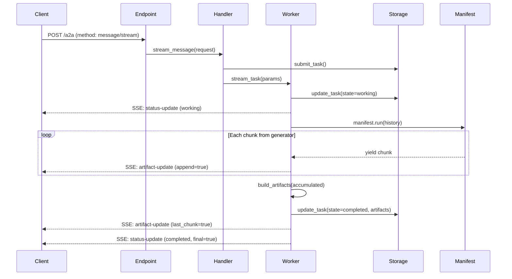

# Streaming (SSE) — Server-Sent Events for Real-Time Agent Output

Bindu supports **Server-Sent Events (SSE)** for streaming agent responses in real-time. Instead of waiting for the agent to complete its entire response, clients receive incremental chunks as the agent produces them.

## Overview

Streaming is implemented through the full **worker pipeline**, preserving all features that `message/send` provides:

- **State Management** — Tasks transition through `submitted → working → completed`
- **OpenTelemetry Tracing** — Every streaming session is traced end-to-end
- **DID Signing** — Final artifacts are signed with the agent's DID identity
- **Payment Settlement** — x402 payments are verified and settled on completion
- **Push Notifications** — Lifecycle events fire at each state transition
- **Deferred Storage** — Final DID-signed artifacts are persisted on completion

## Architecture



### Key Difference from `message/send`

| Feature | `message/send` | `message/stream` |
|---------|---------------|-----------------|
| Response | Single JSON-RPC response | SSE event stream |
| Worker method | `run_task()` | `stream_task()` |
| Results | Collected then stored | Yielded incrementally |
| Latency | Wait for full response | First chunk immediately |

## Protocol

### Request

Standard A2A JSON-RPC request with `method: "message/stream"`:

```json
{
  "jsonrpc": "2.0",
  "id": 1,
  "method": "message/stream",
  "params": {
    "message": {
      "role": "user",
      "message_id": "...",
      "task_id": "...",
      "context_id": "...",
      "parts": [{ "kind": "text", "text": "Tell me about quantum computing" }]
    },
    "configuration": {
      "history_length": 10,
      "push_notification_config": { "url": "https://..." }
    }
  }
}
```

### Response

HTTP response with `Content-Type: text/event-stream`. Each event is a JSON object preceded by `data: ` and followed by `\n\n`:

#### Status Update Events

```
data: {"kind": "status-update", "task_id": "...", "context_id": "...", "status": {"state": "working", "timestamp": "..."}, "final": false}

data: {"kind": "status-update", "task_id": "...", "context_id": "...", "status": {"state": "completed", "timestamp": "..."}, "final": true}
```

#### Artifact Update Events

```
data: {"kind": "artifact-update", "task_id": "...", "context_id": "...", "artifact": {"artifact_id": "...", "name": "streaming_response", "parts": [{"kind": "text", "text": "Quantum computing is"}]}, "append": true, "last_chunk": false}

data: {"kind": "artifact-update", "task_id": "...", "context_id": "...", "artifact": {"artifact_id": "...", "name": "streaming_response", "parts": [{"kind": "text", "text": " a field that uses"}]}, "append": true, "last_chunk": false}

data: {"kind": "artifact-update", "task_id": "...", "context_id": "...", "artifact": {"artifact_id": "...", "parts": [{"kind": "text", "text": "Full DID-signed response..."}]}, "last_chunk": true}
```

### Event Types

| Event | Description | `final` |
|-------|-------------|---------|
| `status-update` (working) | Agent started processing | `false` |
| `artifact-update` (append) | Incremental chunk | N/A |
| `artifact-update` (last_chunk) | Final DID-signed artifact | N/A |
| `status-update` (completed) | Task finished successfully | `true` |
| `status-update` (failed) | Task failed with error | `true` |
| `status-update` (input-required) | Agent needs more input | `false` |

## Implementation Details

### ManifestWorker.stream_task()

The core streaming method on `ManifestWorker`. It's an **async generator** that yields typed SSE events:

```python
async def stream_task(
    self, params: TaskSendParams
) -> AsyncGenerator[TaskStatusUpdateEvent | TaskArtifactUpdateEvent, None]:
```

Pipeline:
1. **Load & validate** — Same as `run_task()`
2. **Transition to working** — Storage updated, lifecycle notification sent
3. **Build history** — Supports `referenceTaskIds` and context-based history
4. **Inject system prompt** — If structured responses are enabled
5. **Execute manifest** — Handles sync generators, async generators, and direct returns
6. **Yield chunks** — Each generator chunk becomes a `TaskArtifactUpdateEvent`
7. **Build final artifact** — DID-signed artifact from accumulated result
8. **Detect state** — Uses `ResponseDetector` (same as `run_task()`)
9. **Settle payment** — x402 settlement on completion
10. **Yield final status** — `completed` or `failed` with `final=True`

### Storage.append_artifact_chunk()

Optional storage method for incremental artifact persistence (available for custom streaming strategies):

```python
async def append_artifact_chunk(
    self, task_id: UUID, artifact: Artifact
) -> None:
```

- **InMemoryStorage**: Finds existing artifact by `artifact_id` and extends `parts`
- **PostgresStorage**: Uses `jsonb_concat` for atomic JSONB array append
- **Base class**: Default no-op (safe for custom implementations)

> **Note**: The default `stream_task()` implementation uses **deferred persistence** — chunks are
> streamed to the client in real-time, but only the final DID-signed artifacts are written to storage
> on completion. This avoids duplicate artifacts and ensures only signed content is persisted.
> The `append_artifact_chunk()` method is provided for custom worker implementations that need
> incremental persistence (e.g., for crash recovery of long-running streams).

### Stable Artifact IDs

All streaming chunks use a **single `artifact_id`** generated at stream start. This allows clients to reconstruct the full response by concatenating parts from events with the same ID.

## Configuration

### Enable Streaming

Add `streaming: true` to your agent's capabilities:

```python
from bindu.penguin import bindufy

@bindufy(
    name="My Streaming Agent",
    capabilities={"streaming": True},
)
def my_agent(message_history):
    # Return a generator for streaming
    for word in response.split():
        yield word
```

### Settings

Streaming is automatically routed via `settings.py`:

```python
method_handlers = {
    "message/send": "send_message",
    "message/stream": "stream_message",  # ← Added
    ...
}
```

Payment protection and auth permissions are configured identically to `message/send`.

## Error Handling

Errors during streaming produce a `status-update` event with `state: "failed"`:

```
data: {"kind": "status-update", "task_id": "...", "context_id": "...", "status": {"state": "failed", "timestamp": "..."}, "final": true, "metadata": {"error": "Agent execution failed: ..."}}
```

- **Pre-execution errors** (task not found, invalid state): Raised before any events
- **Mid-stream errors**: Partial chunks are delivered, then a `failed` status event
- **Payment errors**: Do not affect the completed response delivery

## Client Example

### Python (httpx)

```python
import httpx
import json

async with httpx.AsyncClient() as client:
    async with client.stream(
        "POST",
        "http://localhost:3773/a2a",
        json={
            "jsonrpc": "2.0",
            "id": 1,
            "method": "message/stream",
            "params": {
                "message": {
                    "role": "user",
                    "message_id": "msg-1",
                    "task_id": "task-1",
                    "context_id": "ctx-1",
                    "parts": [{"kind": "text", "text": "Hello!"}]
                }
            }
        },
        headers={"Content-Type": "application/json"},
    ) as response:
        async for line in response.aiter_lines():
            if line.startswith("data: "):
                event = json.loads(line[6:])
                if event["kind"] == "artifact-update":
                    text = event["artifact"]["parts"][0]["text"]
                    print(text, end="", flush=True)
                elif event["kind"] == "status-update" and event["final"]:
                    print(f"\n[{event['status']['state']}]")
```

### JavaScript (EventSource)

```javascript
const response = await fetch('/a2a', {
  method: 'POST',
  headers: { 'Content-Type': 'application/json' },
  body: JSON.stringify({
    jsonrpc: '2.0',
    id: 1,
    method: 'message/stream',
    params: {
      message: {
        role: 'user',
        message_id: 'msg-1',
        task_id: 'task-1',
        context_id: 'ctx-1',
        parts: [{ kind: 'text', text: 'Hello!' }]
      }
    }
  })
});

const reader = response.body.getReader();
const decoder = new TextDecoder();

while (true) {
  const { done, value } = await reader.read();
  if (done) break;

  const lines = decoder.decode(value).split('\n');
  for (const line of lines) {
    if (line.startsWith('data: ')) {
      const event = JSON.parse(line.slice(6));
      // Handle event...
    }
  }
}
```
